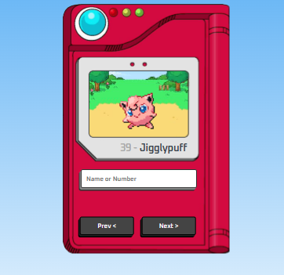

<h1 align="center"> Pokédex - Pokemon </h1>

Projeto gratuito, promovido pelo canal Manual Dev para ensino de tecnologias WEB.  

  <a href="#-tecnologias">Tecnologias</a>&nbsp;&nbsp;&nbsp;|&nbsp;&nbsp;&nbsp;
  <a href="#-projeto">Projeto</a>

 

  

## 🚀 Tecnologias

Esse projeto foi desenvolvido com as seguintes tecnologias:

- HTML e CSS
- JavaScript
- Git e Github

## 💻 Projeto  

- [Acesse o projeto finalizado, online]( https://kellyfiocchi.github.io/pokedex/)

